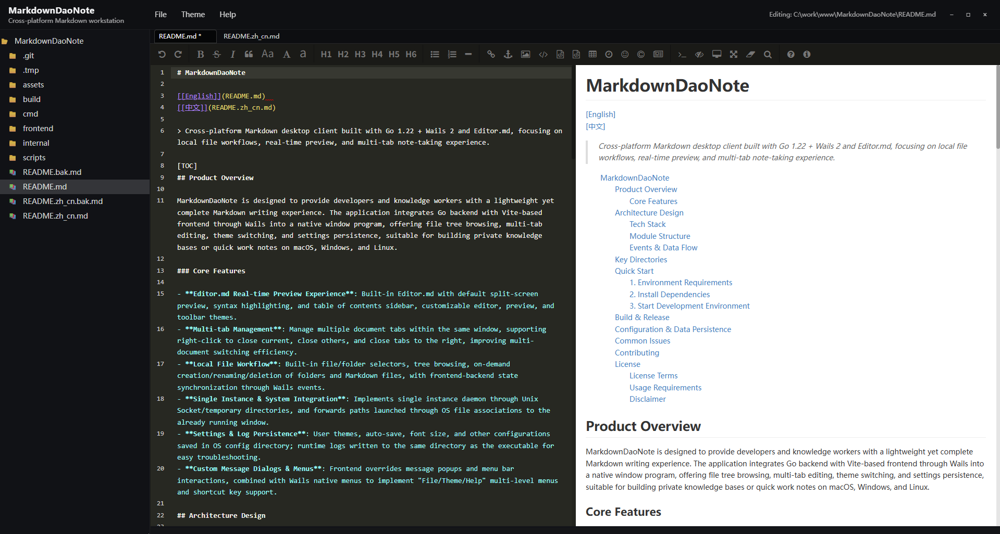

# GitHub Pages 截图路径修复

## 🐛 问题

GitHub Pages 无法显示截图，因为图片文件不在 `docs/` 部署目录中。

## 🔍 原因

### 问题分析

**原始路径结构**：
```
项目根目录/
├── assets/
│   └── preview/          ← 截图原始位置
│       └── *.png
└── docs/
    └── index.html        ← GitHub Pages 从这里部署
```

**index.html 中的引用**：
```html

```

**问题**：
- GitHub Pages 从 `docs/` 目录部署
- `../` 会尝试访问 `docs/` 的上级目录
- GitHub Pages 无法访问部署目录外的文件
- 导致所有截图 404

## ✅ 解决方案

### 1. 复制截图到 docs 目录

```bash
mkdir -p docs/assets
cp -r assets/preview docs/assets/
```

**新的目录结构**：
```
docs/
├── .nojekyll
├── index.html
├── README.md
├── GITHUB_PAGES_SETUP.md
└── assets/
    └── preview/          ← 截图新位置
        ├── screen1.png (212 KB)
        ├── screen2.png (231 KB)
        ├── screen-theme.png (196 KB)
        ├── screen-full-preview.png (136 KB)
        └── screen-close-preview.png (153 KB)
```

### 2. 更新图片引用路径

**修改前**（相对路径向上）：
```html

```

**修改后**（相对路径同级）：
```html

```

## 📝 修改的文件

### 1. docs/index.html

更新了所有 5 个截图的路径：
- `../assets/preview/` → `assets/preview/`
- 包括 `` 和 `onclick="openModal()"` 中的路径

### 2. docs/README.md

更新文档说明截图位置：
```markdown
截图位于 `docs/assets/preview/` 目录
```

### 3. docs/assets/preview/

新增目录和文件：
- 5 张截图文件
- 总大小：~930 KB

### 4. .github/GITHUB_PAGES_CREATED.md

更新文件结构说明，包含 `assets/` 目录

## 🎯 验证

### 本地测试

```bash
cd docs
python3 -m http.server 8000
# 访问 http://localhost:8000
# 检查截图是否正常显示
```

### GitHub Pages 测试

推送后访问：
```
https://taoismdao.github.io/MarkdownDaoNote/
```

检查：
- ✅ 所有 5 张截图正常显示
- ✅ 点击截图可以放大查看
- ✅ 模态框中的大图正常显示

## 📊 截图列表

| 文件名 | 大小 | 说明 |
|--------|------|------|
| screen1.png | 212 KB | 主界面 - 实时预览 |
| screen2.png | 231 KB | 编辑界面 |
| screen-theme.png | 196 KB | 多主题支持 |
| screen-full-preview.png | 136 KB | 全屏预览模式 |
| screen-close-preview.png | 153 KB | 专注编辑模式 |

**总计**: ~930 KB

## 💡 为什么这样做？

### GitHub Pages 的限制

1. **部署目录隔离**
   - GitHub Pages 只能访问配置的部署目录（`docs/`）
   - 无法访问父目录或兄弟目录

2. **相对路径限制**
   - `../` 在部署环境中不会指向仓库根目录
   - 需要将所有资源放在部署目录内

3. **最佳实践**
   - 所有静态资源（图片、CSS、JS）应在部署目录内
   - 使用相对路径或绝对路径引用

## 🔄 资源管理策略

### 方案 A：复制资源（当前方案）✅

**优点**：
- 简单直接
- 部署独立，不依赖其他目录
- GitHub Pages 可以直接访问

**缺点**：
- 资源重复（项目根和 docs 各一份）
- 需要手动同步更新

### 方案 B：软链接

**不可行**：
- Git 不会跟踪软链接的目标文件
- GitHub Pages 无法解析软链接

### 方案 C：从根目录部署

**配置**：
- Branch: `main`
- Folder: `/` (root)

**优点**：
- 无需复制资源
- 直接访问所有文件

**缺点**：
- 暴露所有项目文件
- 不够整洁
- 可能暴露敏感文件

## 🎨 路径最佳实践

### 推荐的路径结构

```
docs/
├── index.html           # 主页
├── assets/              # 所有静态资源
│   ├── images/         # 图片
│   ├── css/            # 样式表（如果分离）
│   └── js/             # JavaScript（如果分离）
└── pages/              # 其他页面（如果有）
```

### 路径引用规则

```html
<!-- ✅ 推荐：相对路径 -->

<link rel="stylesheet" href="assets/css/style.css">

<!-- ❌ 避免：上级目录 -->


<!-- ✅ 可选：绝对路径（用于子页面） -->

```

## 🚀 部署检查清单

推送前确认：

- [ ] 所有资源文件在 `docs/` 目录内
- [ ] 所有路径引用正确（无 `../` 跳出）
- [ ] 本地测试通过（`python -m http.server`）
- [ ] 图片文件大小合理（优化后）
- [ ] `.nojekyll` 文件存在

## ✅ 修复完成

| 项目 | 状态 |
|------|------|
| 截图文件复制 | ✅ 完成 |
| HTML 路径更新 | ✅ 完成 |
| 文档更新 | ✅ 完成 |
| 本地测试 | ⏳ 待测试 |
| 部署验证 | ⏳ 待部署 |

## 📋 下一步

1. **本地测试**：
   ```bash
   cd docs
   python3 -m http.server 8000
   # 访问并检查截图
   ```

2. **提交代码**：
   ```bash
   git add docs/
   git commit -m "fix: 修复 GitHub Pages 截图路径问题"
   git push origin main
   ```

3. **等待部署**（1-3分钟）

4. **验证线上**：访问 https://taoismdao.github.io/MarkdownDaoNote/

现在截图应该可以在 GitHub Pages 上正常显示了！🎉

